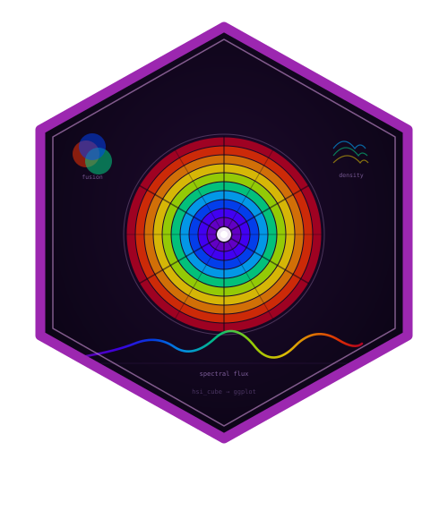
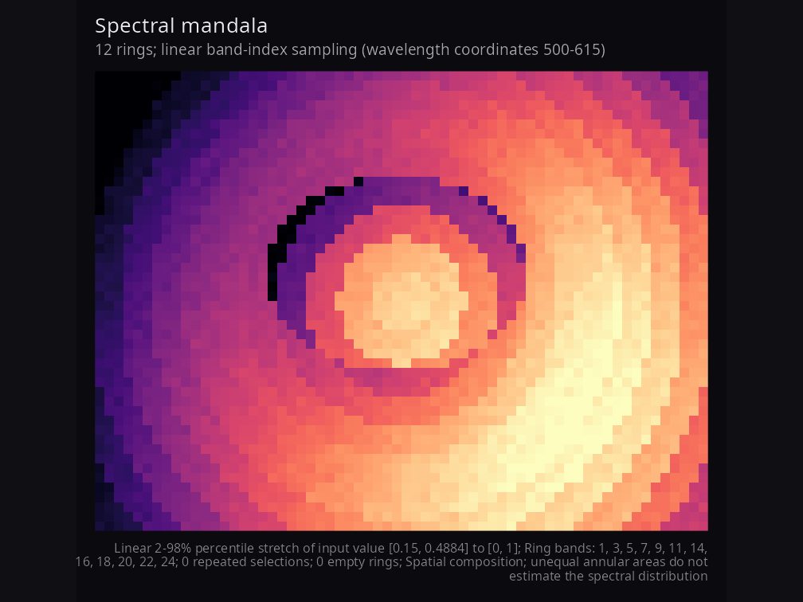
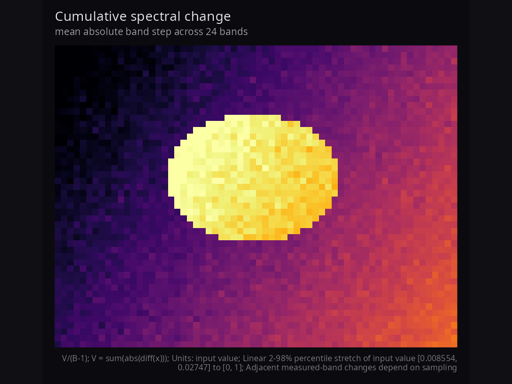
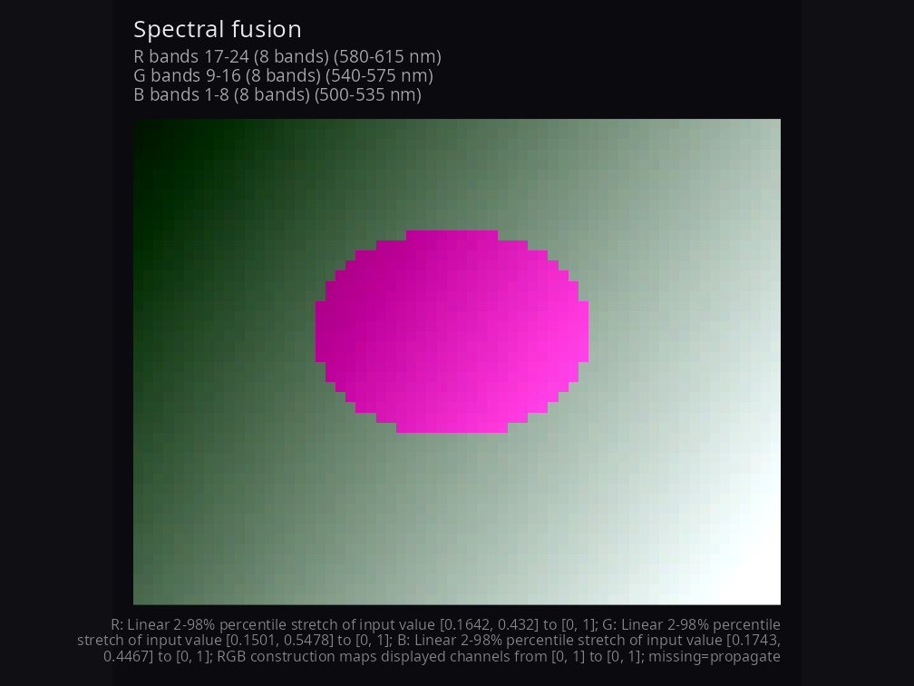
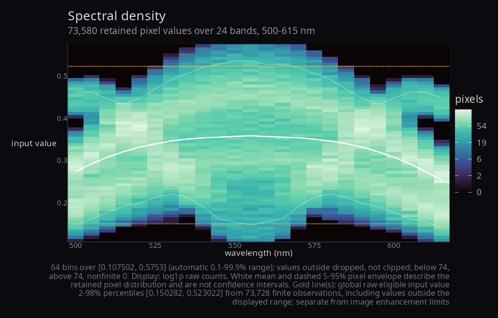
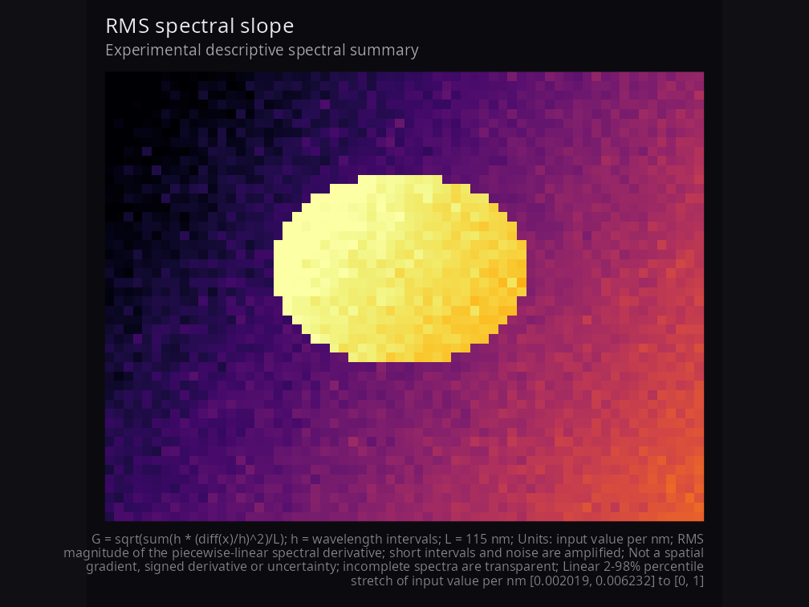
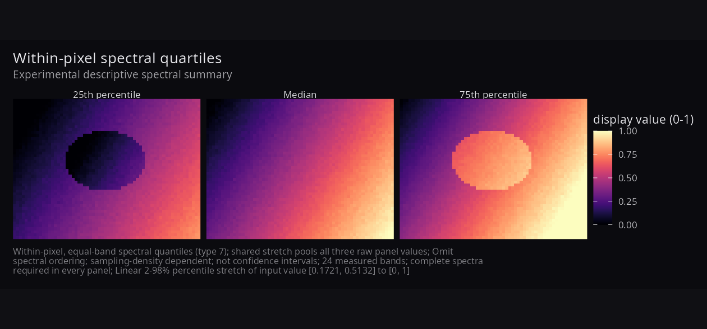

# hyperspectaculR 

[](https://doi.org/10.5281/zenodo.21889974)
[](https://github.com/CTTIR/hyperspectaculR/actions/workflows/R-CMD-check.yaml)
[](https://cttir.github.io/hyperspectaculR/)

Artistic compositions and descriptive summaries of hyperspectral imagery.
The **0.2.0 candidate** consumes an `hsi_cube` or numeric `(rows, cols, bands)`
array and returns composable ggplots. It does not read recordings, calibrate
values or infer physiology. Readers such as
[hyperspectR](https://github.com/CTTIR/hyperspectR) provide upstream integration.

Compositions use the spectral dimension to reveal spatial and spectral
structure. Supported edge cases include single-band density, repeated mandala
selections, overlapping fusion groups and singleton quartiles; these can
reduce to a single-band result. Every figure records what was calculated and
how it was displayed.

## Install and reproduce

Requires R >= 4.1.0 and ggplot2 >= 3.4.0. To install this candidate from a local
checkout and regenerate its public synthetic gallery:

```sh
R CMD INSTALL .
Rscript data-raw/make-showcase.R
```

For optional patchwork composition with ggplot2 3.4.0, the tested compatible
version is patchwork 1.1.3; current patchwork requires a newer ggplot2 in practice.
The minimum-compatibility workflow checks both selected old and current
dependency combinations.

```r
library(hyperspectaculR)
cube <- hsa_demo_cube(seed = 42)  # 48 x 64 x 24; physical coordinates in nm
hsa_mandala(cube, n_rings = 12)
hsa_spectral_flux(cube)
hsa_fusion(cube)
hsa_spectral_density(cube, nbins = 64, show_limits = TRUE)
```

The default script needs no recordings or reader packages. Seed, parameters,
version and compact provenance are in `man/figures/gallery-provenance.R`.
An explicit `HSA_SHOWCASE_LAB_RDS` or `HSA_SHOWCASE_CUBERT_PATH` may enable local
laboratory integration under `showcase/laboratory`; failure still leaves the
synthetic gallery and studies available. Calibration must come from known
metadata or a documented calibration workflow, never from numeric range alone.

## Validity, coordinates and display

```r
cube$mask <- matrix(TRUE, 48, 64)
cube$mask[1:4, ] <- FALSE
cube$data[10, 10, 2] <- Inf
p <- hsa_fusion(cube, red = 17:24, green = 9:16, blue = 1:8)
q <- hsa_fusion(cube, red = 17:24, green = 9:16, blue = 1:8,
                missing = "available")
hsa_provenance(q)$missingness  # inspect changing contributor counts

# Extracting $data alone drops cube-level mask/wavelength fields.
# A plain array has band-index coordinates unless attributes provide metadata.
hsa_spectral_density(cube$data)
hsa_mandala(cube, n_rings = 12, sampling = "wavelength")
hsa_fusion(cube, red = c(590, 605), green = c(555, 570),
           blue = c(505, 520), by = "wavelength")
```

Masks exclude spatial pixels; `NA`, `NaN` and infinities exclude observations.
Image quantities require their selected bands to be finite. Fusion defaults to
`missing = "propagate"`; `"available"` averages each channel's finite
contributors and still requires a contribution in all three channels. Default
fusion uses disjoint contiguous index thirds, highest indices to red,
regardless of `by`. Explicit wavelength targets select the nearest measured
band, ties toward the shorter wavelength. Index requests are whole indices;
physical requests require strictly increasing wavelength metadata in nm.

Range and type-7 percentile stretches map raw values to `[0, 1]`. Collapsed
percentile limits fall back to the finite range; constant data map to the dark
endpoint. `stretch = "none"` preserves raw values and checks them against the
fixed `display_limits` domain. Its endpoints must contain every finite rendered
value. Scalar plot data retain `raw_value`; fusion retains `raw_r`, `raw_g`,
`raw_b`. Value labels default to **input value**.

```r
p <- hsa_mandala(cube, n_rings = 12, stretch = "none",
                 display_limits = c(-1, 1), value_label = "input value")
hsa_provenance(p)$enhancement  # endpoints, exclusions, method and fallback
p + ggplot2::theme(plot.title = ggplot2::element_text(size = 16)) +
  ggplot2::labs(title = "My scene")
```

`+ theme()` and `+ labs()` preserve original-rendering provenance. Arbitrary
later edits are not recalculated. Inspect each component before assembling a
patchwork; `hsa_provenance()` rejects the combined object.

## Synthetic gallery



Mandala rings are spatial areas, not estimates of a spectral distribution.
Physical targets may repeat measured bands; full ring selections and empty
rings remain in provenance when captions abbreviate long selections.



For adjacent measured values, total change is `V = sum(abs(diff(x)))`; default
mean step is `V/(B-1)`. Both have input-value units (the latter per measured
step). `normalization = "wavelength_span"` gives `V/L` in input value per nm,
the mean absolute slope of a piecewise-linear spectrum across span `L`.
For a noiseless rise from 0 to 1 across 400 nm, three and six bands give mean
steps 0.5 and 0.2, but both give a physical slope of 0.0025 per nm. This does
not establish universal sampling comparability: gaps miss unresolved peaks,
and interpolation cannot recover them.





Density bins include both outer limits and are right closed internally. Values
outside the range are dropped, not clipped. Per band, `eligible = finite +
nonfinite` and `finite = below + kept + above`; masked pixels are excluded from
eligible counts. `normalise = "band"` divides by **retained** counts; empty
bands have missing shares and gaps in overlays. White binned means and 5–95%
pixel envelopes describe retained populations, not confidence intervals.
Gold references use raw finite eligible observations, including those outside
the displayed range; they are separate from image enhancement endpoints.
Histogram rectangles use midpoint boundaries on irregular spectral grids;
one band uses a disclosed coordinate width of one. Raw counts, breaks,
references and accounting are available through `hsa_provenance()`.

## Experimental descriptive summaries



`hsa_spectral_gradient()` computes
`G = sqrt(sum(h * (diff(x)/h)^2)/L)` for wavelength intervals `h` and span `L`.
It is nonnegative, in input value per nm, and requires physical coordinates.
It is neither a signed derivative nor a spatial gradient. At wavelengths
`(500, 501, 505)` with values `(0, 2, 2)`, mean absolute slope is 0.4 per nm
and RMS slope is approximately 0.894427 per nm. Short intervals and noise
can dominate. For independent noise of SD `sigma` on a flat signal,
`E[G^2] = 2 * sigma^2 / L * sum(1/h)`; adding noisy bands can increase G.



`hsa_spectral_quartiles()` gives type-7 25th, 50th and 75th percentiles,
weighting **measured bands equally**. The values `(0, 1, 4, 9)` give
`(0.75, 2.5, 5.25)`; reordering them preserves quartiles but can change flux.
One pooled stretch and one legend apply to all three panels. These quantities
discard spectral order, depend on sampling density and are not uncertainty
intervals. Both new summaries are experimental, descriptive and require
complete finite spectra. No physiological interpretation follows from them.
See the [sampling evidence (source Markdown)](planning/evidence/sampling.md) for independent
examples, assumptions and reproducible experiments.

## Migrating to 0.2.0

Visible results can change: invalid image pixels are transparent; zero flux
and constant images use the dark endpoint; default fusion thirds cover every
band exactly once; raw display domains stay fixed; density coordinates,
retained populations and reference lines are now explicit. Missing wavelengths
are labelled as band indices, not nm. Experimental slope/quartile renderers and
`hsa_provenance()` are new exports.

Malformed masks or wavelengths, fractional/out-of-range indices, duplicate
selections within a fusion group, incomplete explicit RGB groups, invalid
counts/probabilities, conflicting flux normalization controls, and raw values
outside `display_limits` now raise errors. Entirely invalid renderings fail
clearly. Existing argument order and `normalise` flux behavior are retained;
use the appended `normalization` selector for explicit physical units.
