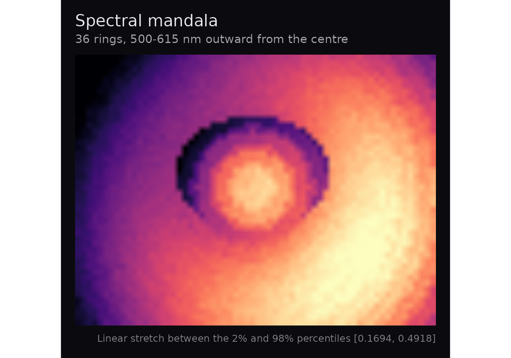
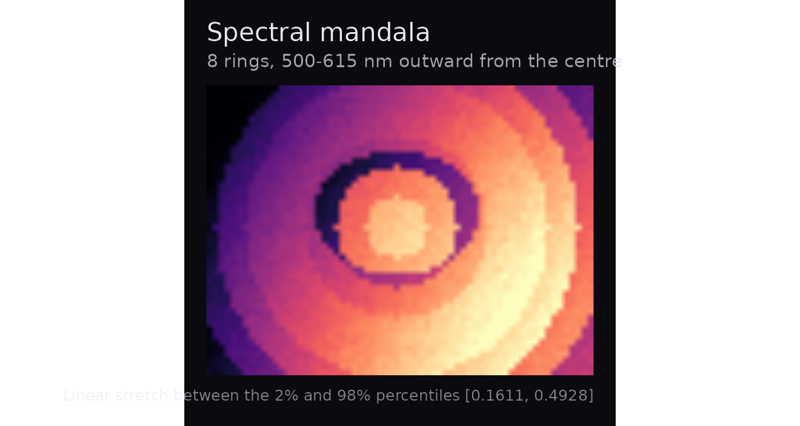
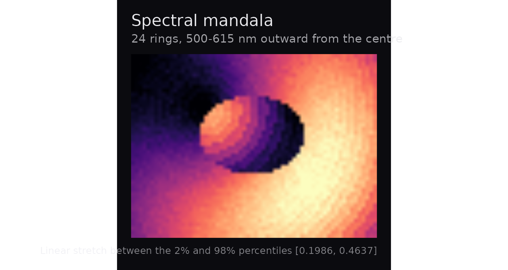
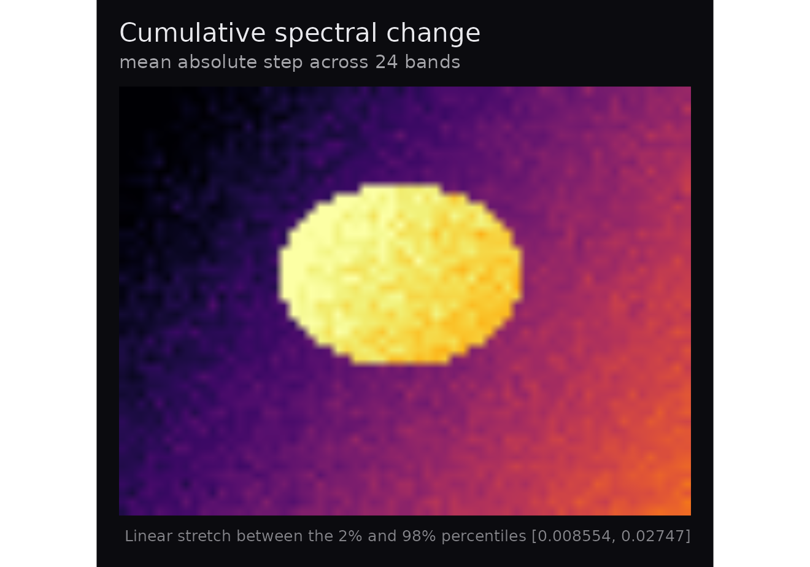
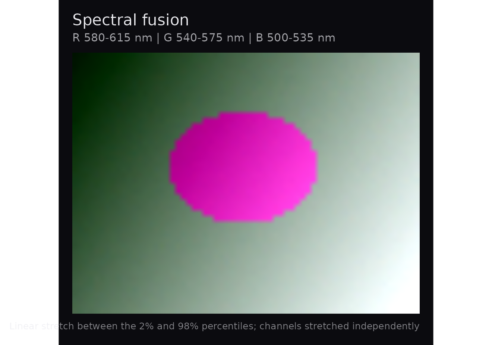
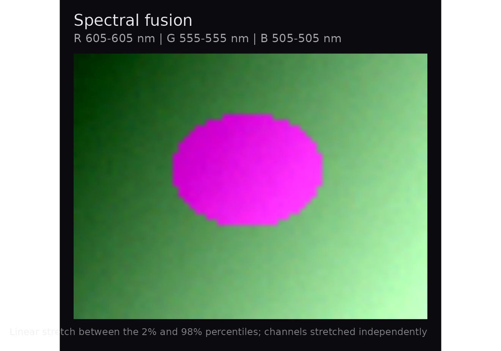
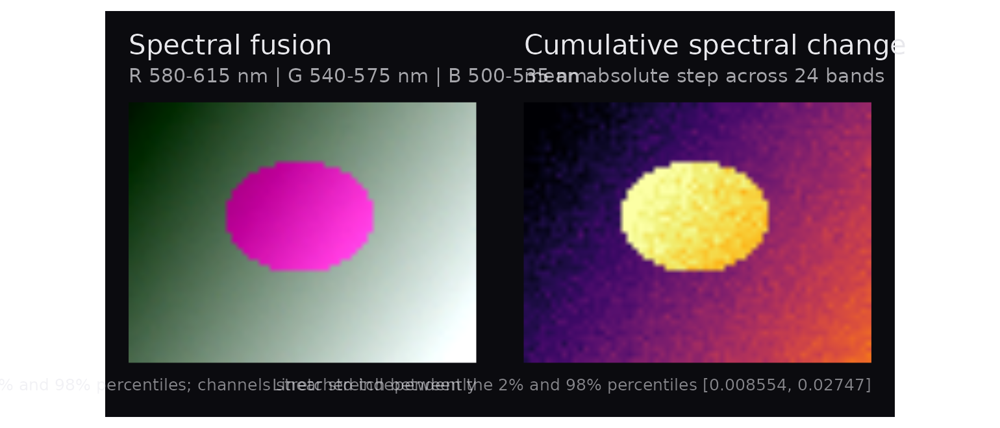

# Making hyperspectral figures worth looking at

A hyperspectral cube holds a full spectrum at every pixel, and almost
every figure made from one throws that away — a single band, or three
bands pushed into red, green and blue. `hyperspectaculR` is for the
other kind of figure: compositions that could not be produced from any
single wavelength, made to be looked at rather than measured off.

It reads nothing and analyses nothing. Reading belongs to
[`tivis.r`](https://github.com/CTTIR/tivis.r) and
[`cuvis.r`](https://github.com/CTTIR/cuvis.r); the cube class and the
analysis pipeline belong to
[`hyperspectR`](https://github.com/CTTIR/hyperspectR). This package
takes an `hsi_cube` and returns a `ggplot`.

Everything below runs on a small synthetic cube bundled with the
package, so the vignette builds without any recorded data.

``` r

cube <- hsa_demo_cube()
dim(cube$data)
#> [1] 48 64 24
range(cube$wavelengths)
#> [1] 500 615
```

## Three compositions

### A radial spectral sweep

[`hsa_mandala()`](https://cttir.github.io/hyperspectaculR/reference/hsa_mandala.md)
draws concentric annuli, each taken from a different wavelength: the
innermost ring is the shortest wavelength, the outermost the longest.
One image, sweeping the whole spectral axis outward from a centre.

``` r

hsa_mandala(cube)
```



Fewer rings give bolder banding; more rings sample the spectrum finely
enough that the transition reads as continuous.

``` r

hsa_mandala(cube, n_rings = 8)
```



The centre is yours to choose, which matters when the subject is not in
the middle of the frame.

``` r

hsa_mandala(cube, centre = c(20, 15), n_rings = 24)
```



### How much a pixel moves across the spectrum

[`hsa_spectral_flux()`](https://cttir.github.io/hyperspectaculR/reference/hsa_spectral_flux.md)
sums the absolute change between consecutive bands. Flat spectra go
dark; pixels whose reflectance swings across the spectrum light up.

``` r

hsa_spectral_flux(cube)
```



This is not a variance map. Variance is blind to the order of the bands,
whereas this responds to spectral *shape* — two pixels with identical
variance score differently if one changes smoothly and the other
oscillates.

### Colour from band groups

[`hsa_fusion()`](https://cttir.github.io/hyperspectaculR/reference/hsa_fusion.md)
builds a composite by averaging three groups of bands rather than
picking three wavelengths. Averaging suppresses per-band sensor noise,
so the result is smoother and more saturated than a three-band
composite, while remaining a simple and disclosable operation.

``` r

hsa_fusion(cube)
```



Groups can be given as wavelengths when that is how you think about the
subject:

``` r

wl <- cube$wavelengths
hsa_fusion(cube, red = wl[22], green = wl[12], blue = wl[2], by = "wavelength")
```



## Saying what you did to the image

Contrast stretching is what makes hyperspectral data legible on a
screen. It is also the easiest way to make a figure imply something the
data does not. So every function here captions the stretch it applied
and the limits it used:

``` r

hsa_mandala(cube)$labels$caption
#> [1] "Linear stretch between the 2% and 98% percentiles [0.1694, 0.4918]"
hsa_spectral_flux(cube, stretch = "range")$labels$caption
#> [1] "Linear stretch over [0.006715, 0.02887]"
hsa_mandala(cube, stretch = "none")$labels$caption
#> [1] "No contrast stretch applied"
```

That caption travels with the figure. If a reviewer asks what was done
to the image, the answer is printed underneath it.

## Colour that survives the journey

[`hsa_palette()`](https://cttir.github.io/hyperspectaculR/reference/hsa_palette.md)
offers only ramps that are monotonic in lightness, so ordering is
preserved in greyscale printing and remains legible to colourblind
readers.

``` r

head(hsa_palette("magma", n = 6))
#> [1] "#000004FF" "#3B0F70FF" "#8C2981FF" "#DE4968FF" "#FE9F6DFF" "#FCFDBFFF"
```

Rainbow-like ramps are excluded on purpose, with one exception kept for
screen-only use — and it tells you:

``` r

invisible(hsa_palette("turbo", n = 4))
#> Warning: "turbo" is not monotonic in lightness.
#> ℹ It reads well on screen but loses ordering in greyscale; prefer "viridis" or
#>   "magma" for print.
```

## Composing figures

Everything is a `ggplot`, so panels combine with `patchwork`, re-theme,
and export through
[`ggsave()`](https://ggplot2.tidyverse.org/reference/ggsave.html) at
whatever size and resolution a journal wants. Nothing writes a file as a
side effect.

``` r

library(patchwork)
hsa_fusion(cube) + hsa_spectral_flux(cube)
```



For print, export as vector where the composition allows it, or at
300–600 dpi where it does not — these are raster images, so a
high-resolution PNG or TIFF is usually the honest choice:

``` r

ggplot2::ggsave("figure-1.png", hsa_mandala(cube),
                width = 180, height = 130, units = "mm", dpi = 600)
```

## Working from real recordings

With `hyperspectR` installed, the same functions take real cubes from
either supported instrument:

``` r

library(hyperspectR)

# TIVITA, via tivis.r -- no vendor SDK needed
cube <- hs_read_tivita("2019_11_25_13_29_24_SpecCube.dat")

# Cubert, via cuvis.r and the CUVIS SDK
# cube <- hs_read_cubert("session.cu3s")

hsa_fusion(cube, red = 850, green = 650, blue = 550, by = "wavelength")
```

Both readers return the same `hsi_cube`, so nothing here changes between
instruments — only the wavelengths in the caption.
