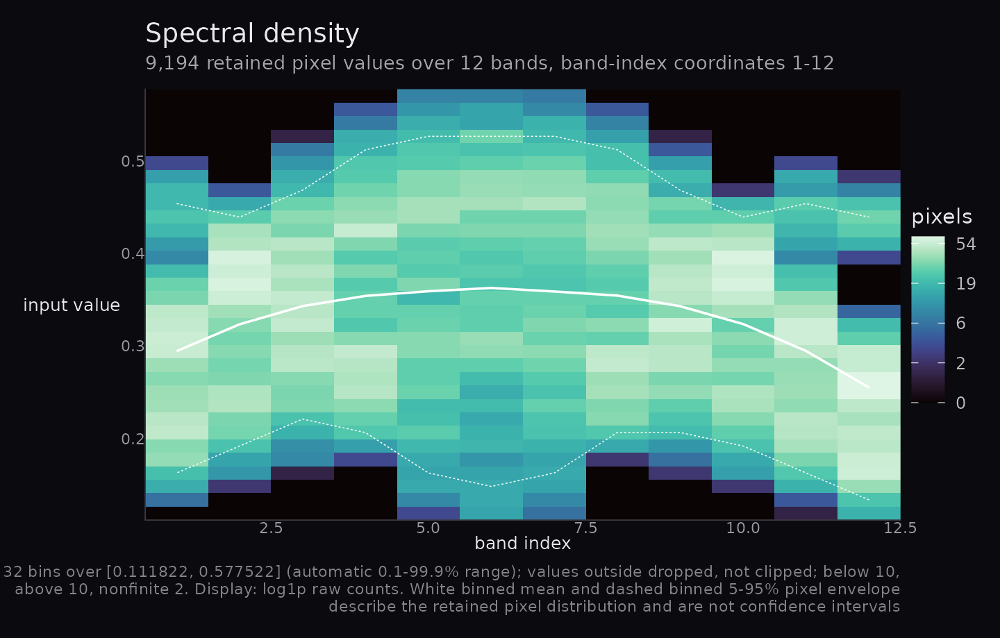
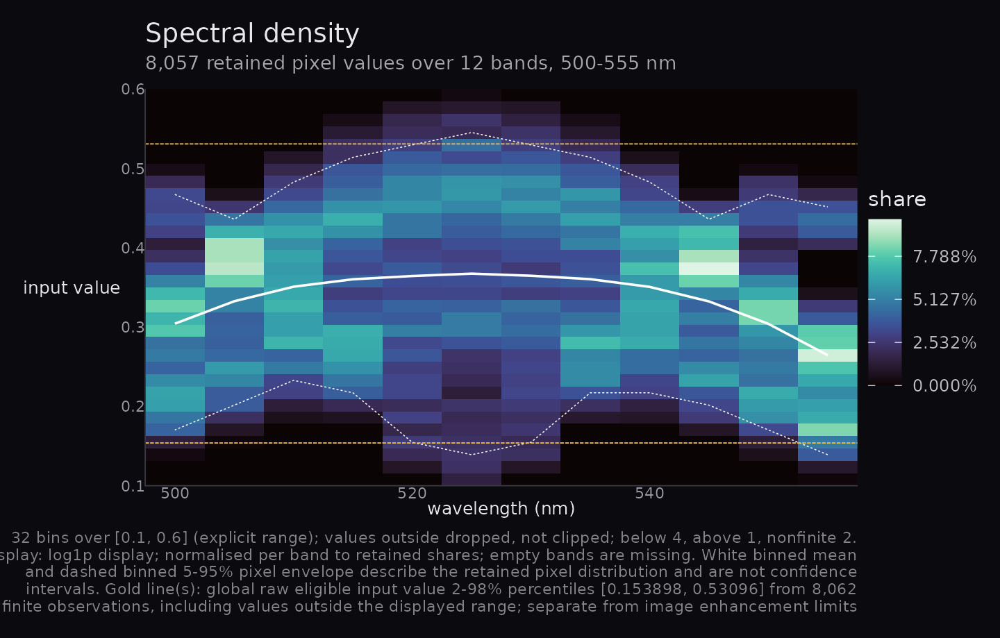
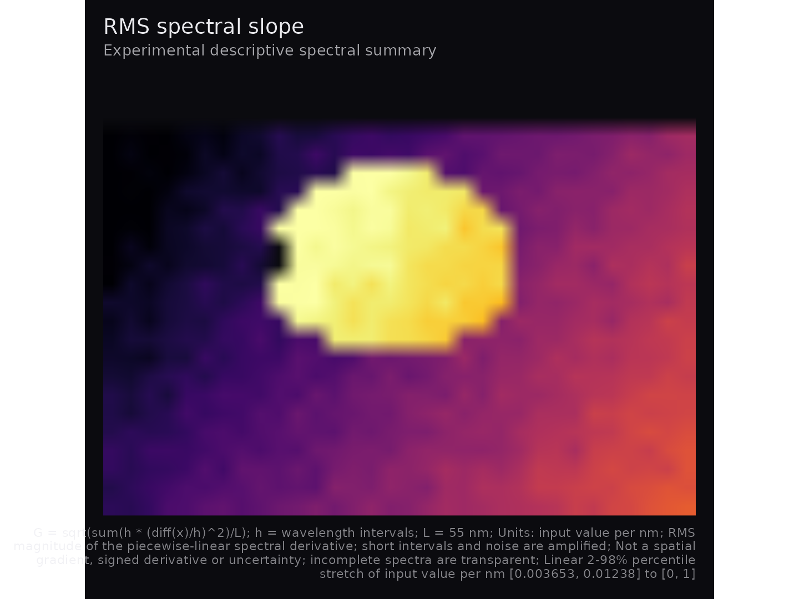
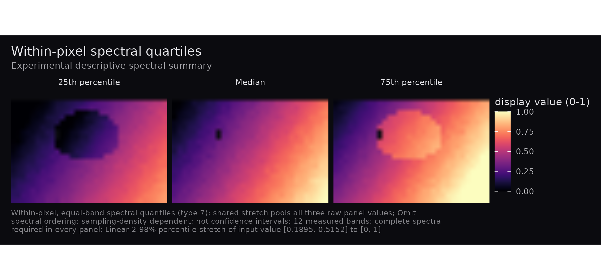

# Compositions with inspectable spectral quantities

The 0.2.0 candidate creates compositions and descriptive summaries from
an `hsi_cube` or real numeric `(rows, cols, bands)` array. Reading
recordings and calibration happen upstream. The default label is **input
value**: a range such as 0–1 does not establish calibrated reflectance.
These plots do not support physiological inference.

## Inputs and missing observations

``` r

cube <- hsa_demo_cube(rows = 24, cols = 32, bands = 12, seed = 42)
cube$mask <- matrix(TRUE, 24, 32)
cube$mask[1:3, ] <- FALSE
cube$data[10, 10, 2] <- Inf
cube$data[11, 10, 3] <- NA_real_
```

A mask must be a logical spatial matrix without missing entries. `FALSE`
excludes a pixel; nonfinite observations are excluded separately.
Metadata must contain one strictly increasing finite wavelength in nm
per band. Arrays can carry `mask` and `wavelengths` attributes. Without
wavelengths the coordinates are **band indices**; physical selection and
slopes require nm.

``` r

hsa_spectral_density(cube$data, nbins = 32)
```



## Selection and display domains

``` r

p <- hsa_mandala(cube, n_rings = 8, sampling = "wavelength")
p
```


``` r

hsa_provenance(p)$selection$ring_band_indices
#> [1]  1  3  4  6  7  9 10 12
```

Default mandala targets are linear in band index. Physical targets are
equally spaced in nm and select nearest measured bands, with ties toward
shorter wavelengths. Repeated selections and empty rings preserve
geometry; the full selection is in provenance. Unequal ring areas are a
spatial composition, not a spectral distribution estimate. One ring
selects the first band.

``` r

strict <- hsa_fusion(cube)
available <- hsa_fusion(cube, red = 9:12, green = 5:8, blue = 1:4,
                        missing = "available")
available
#> Warning: Removed 96 rows containing missing values or values outside the scale range
#> (`geom_raster()`).
```


``` r

hsa_provenance(available)$missingness$contributors
#> $red
#> $red$selected_bands
#> [1] 4
#> 
#> $red$minimum
#> [1] 0
#> 
#> $red$maximum
#> [1] 4
#> 
#> $red$complete_pixels
#> [1] 672
#> 
#> $red$no_contributor_pixels
#> [1] 96
#> 
#> 
#> $green
#> $green$selected_bands
#> [1] 4
#> 
#> $green$minimum
#> [1] 0
#> 
#> $green$maximum
#> [1] 4
#> 
#> $green$complete_pixels
#> [1] 672
#> 
#> $green$no_contributor_pixels
#> [1] 96
#> 
#> 
#> $blue
#> $blue$selected_bands
#> [1] 4
#> 
#> $blue$minimum
#> [1] 0
#> 
#> $blue$maximum
#> [1] 4
#> 
#> $blue$complete_pixels
#> [1] 670
#> 
#> $blue$no_contributor_pixels
#> [1] 96
```

All default RGB groups are disjoint contiguous index thirds, high bands
to red, even with `by = "wavelength"`. Explicit groups must all be
supplied. They may overlap between channels; duplicates within a group
are errors. A one-band explicit fusion is supported. Wavelength targets
must be in range and resolve to distinct bands within each group:

``` r

hsa_provenance(hsa_fusion(cube, red = c(545, 555), green = c(525, 535),
                          blue = c(500, 510), by = "wavelength"))$selection
#> $by
#> [1] "wavelength"
#> 
#> $default
#> [1] FALSE
#> 
#> $red
#> $red$requested
#> [1] 545 555
#> 
#> $red$indices
#> [1] 10 12
#> 
#> $red$coordinates
#> [1] 545 555
#> 
#> 
#> $green
#> $green$requested
#> [1] 525 535
#> 
#> $green$indices
#> [1] 6 8
#> 
#> $green$coordinates
#> [1] 525 535
#> 
#> 
#> $blue
#> $blue$requested
#> [1] 500 510
#> 
#> $blue$indices
#> [1] 1 3
#> 
#> $blue$coordinates
#> [1] 500 510
```

`missing = "propagate"` requires every selected band. `"available"`
averages finite contributors separately by channel, still requiring all
three channels to have a contribution. It changes the contributing
population and records each channel’s selected-band count,
minimum/maximum contributors, complete-pixel count and
no-contributor-pixel count. Per-pixel contributor counts are not
retained. Missing RGB values are transparent.

``` r

p <- hsa_mandala(cube, n_rings = 8, stretch = "none",
                 display_limits = c(-1, 1))
hsa_provenance(p)$enhancement
#> $limits
#> [1] -1  1
#> 
#> $requested_method
#> [1] "none"
#> 
#> $effective_method
#> [1] "none"
#> 
#> $fallback
#> NULL
#> 
#> $probs
#> [1] 0.02 0.98
#> 
#> $quantile_type
#> [1] 7
#> 
#> $clipped_below
#> [1] 0
#> 
#> $clipped_above
#> [1] 0
#> 
#> $finite_count
#> [1] 672
#> 
#> $excluded_count
#> [1] 96
#> 
#> $display_limits
#> [1] -1  1
```

Range and type-7 percentile stretches map to `[0, 1]`. A collapsed
percentile interval falls back to the finite range; constants map to the
dark endpoint. `"none"` preserves raw values and requires them to fit
the fixed domain. The record includes requested/effective method,
fallback, raw endpoints and clipping/exclusion counts. Plot data keep
`raw_value` (or raw RGB channels).

``` r

changed <- p + ggplot2::labs(title = "Selected spatial scene") +
  ggplot2::theme(plot.title = ggplot2::element_text(size = 16))
identical(hsa_provenance(p), hsa_provenance(changed))
#> [1] TRUE
```

Provenance describes the original rendering. Ordinary theme/lab
additions preserve it; arbitrary later plot edits are not recalculated.
Inspect each component before patchwork composition. The accessor
rejects a combined patchwork. Records contain no source cube or
arbitrary input metadata.

## Exact density populations

``` r

density <- hsa_spectral_density(cube, nbins = 32, limits = c(.1, .6),
                                normalise = "band", show_limits = TRUE)
density
```



``` r

accounting <- hsa_provenance(density)$missingness
with(accounting, all(finite == below + kept + above))
#> [1] TRUE
with(accounting, all(eligible == finite + nonfinite))
#> [1] TRUE
```

Limits include both endpoints, with right-closed interior bins. Outside
values are dropped, not clipped. Band shares divide by retained counts.
Empty bands have missing shares and gaps in the overlays. White binned
means and 5–95% pixel envelopes describe retained populations, not
confidence intervals. Gold lines use global raw finite eligible
observations, including those outside histogram limits; they are
separate from image enhancement limits. Automatic limits use type-7
0.1–99.9% quantiles, with a disclosed finite-range or constant padding
fallback. Irregular wavelengths have midpoint rectangle boundaries;
single-band density discloses a width-one fallback. Raw `H`, breaks,
references and accounting remain inspectable in the enhancement record.

## Sampling and experimental summaries

For adjacent measured values, total variation is
`V = sum(abs(diff(x)))`; default mean step is `V/(B-1)` in input-value
units per measured step. `normalization = "wavelength_span"` computes
`V/L` in input value per nm. A rise from 0 to 1 across 400 nm has mean
steps 0.5 and 0.2 at three and six samples, while both physical slopes
equal 0.0025 per nm. Physical units define the quantity; they do not
correct missing peaks, noise or unequal sampling.

``` r

example <- structure(list(data = array(c(0, 2, 2), c(1, 1, 3)),
                          wavelengths = c(500, 501, 505)), class = "hsi_cube")
hsa_spectral_flux(example, normalization = "wavelength_span")$data$raw_value
#> [1] 0.4
hsa_spectral_gradient(example)$data$raw_value
#> [1] 0.8944272
hsa_spectral_gradient(cube)
```



The independently verified values are 0.4 and approximately 0.894427 per
nm. Experimental RMS slope is `G = sqrt(sum(h * (diff(x)/h)^2)/L)` for
wavelength intervals `h`. It is nonnegative, loses derivative sign, and
is not a spatial gradient or uncertainty. Short intervals amplify noise.
On a flat signal with independent noise SD `sigma`,
`E[G^2] = 2 * sigma^2 / L * sum(1/h)`; increasing band count may
increase this quantity. No smoothing or noise correction is applied.
Both physical slopes bridge unobserved intervals with straight lines;
interpolating extra points does not reconstruct absent information.

``` r

hsa_spectral_quartiles(cube)
```



``` r

quartile_example <- array(c(0, 1, 4, 9), c(1, 1, 4))
hsa_spectral_quartiles(quartile_example)$data$raw_value
#> [1] 0.75 2.50 5.25
```

Type-7 quartiles are `(0.75, 2.5, 5.25)`. Permuting the bands preserves
them but can change flux. These experimental panels weight measured
bands equally, discard order and depend on sampling density. They are
not uncertainty intervals. All three panels share complete-spectrum
validity and one pooled stretch/domain/legend. A single band gives
identical panels. Experimental summaries offer descriptive comparisons,
without universal instrument or sampling comparability.

## Migration from 0.1.0

Masked/nonfinite pixels, dark endpoints, fusion thirds, raw domains,
density geometry and retained counts can change visible output. Missing
wavelengths are now labelled as indices. New exports include provenance,
RMS slope and quartiles. Existing argument order and `normalise` remain
supported; conflicting explicit `normalise`/`normalization` values
error. Malformed metadata, fractional or out-of-range indices, duplicate
within-group selections, incomplete RGB requests, invalid
counts/probabilities and raw values outside the display domain now fail
explicitly. Entirely invalid outputs fail instead of producing an
apparently measured blank image.
