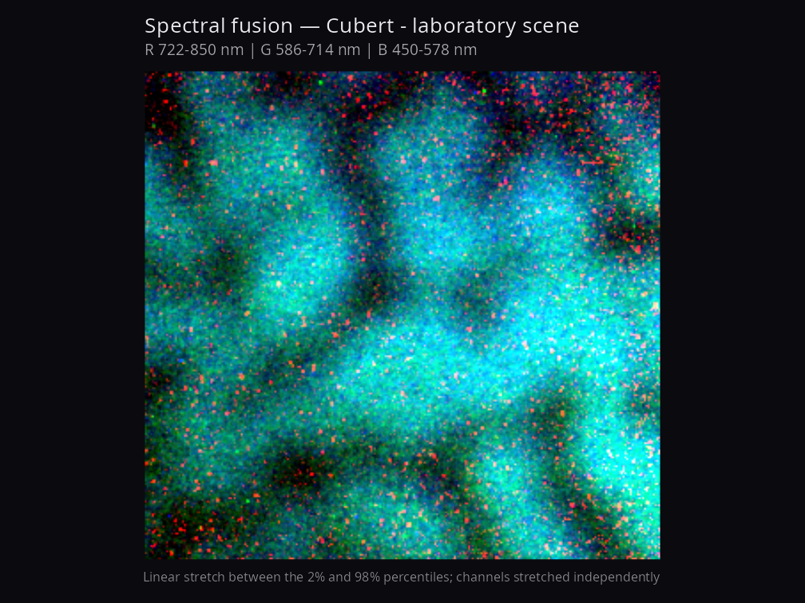
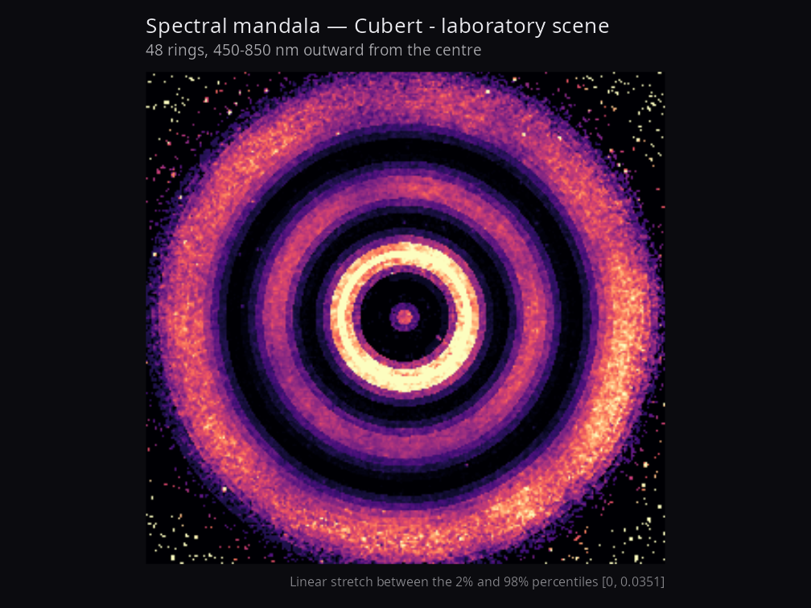
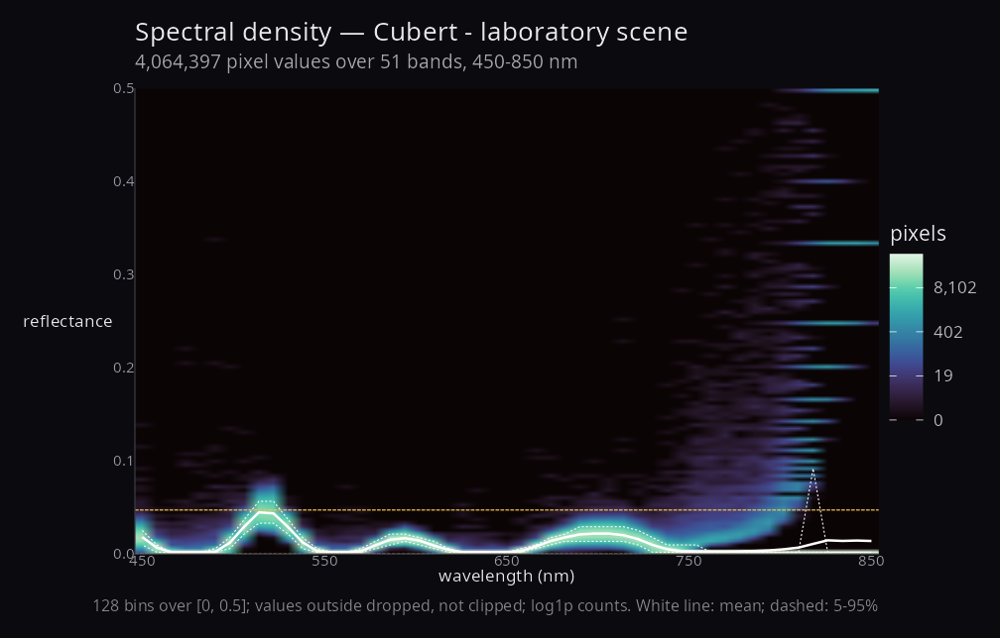

# hyperspectaculR

[](https://doi.org/10.5281/zenodo.21889974)

Publication-grade artistic visualisation of hyperspectral imagery.

Where [`hyperspectR`](https://github.com/CTTIR/hyperspectR) renders
cubes for *inspection* — quick looks, diagnostics, clinical index maps —
`hyperspectaculR` renders them for *display*: figures meant to be looked
at, in a paper or on a wall. It reads nothing and analyses nothing. It
consumes the `hsi_cube` class and returns `ggplot` objects.

## Design

**Compositions that use the spectral axis.** A false-colour picture of
one band is not interesting; anything in this package should be
impossible to produce from a single wavelength. A radial mandala sweeps
the spectrum outward from a centre; a flux field measures how much a
pixel’s reflectance moves across the spectrum; a fusion averages band
*groups* rather than picking three wavelengths.

**Every figure states its own enhancement.** Contrast stretching is what
makes hyperspectral data legible, and also what makes it easy to
mislead. Every function captions the stretch it applied and the limits
it used, so a striking figure remains a defensible one.

**Perceptually uniform colour by default.**
[`hsa_palette()`](https://cttir.github.io/hyperspectaculR/reference/hsa_palette.md)
offers only ramps that are monotonic in lightness, so ordering survives
greyscale printing and is legible to colourblind readers. Asking for
`turbo` warns you.

**Everything returns a ggplot.** Figures compose with `patchwork`,
re-theme, and export reproducibly. Nothing writes a file as a side
effect.

## Installation

``` r

# install.packages("remotes")
remotes::install_github("CTTIR/hyperspectaculR")
```

## Usage

``` r

library(hyperspectaculR)

cube <- hsa_demo_cube()      # or any hyperspectR hsi_cube

hsa_mandala(cube)            # radial spectral sweep
hsa_spectral_flux(cube)      # cumulative change across the spectrum
hsa_fusion(cube)             # multi-band colour composite
```

With real data, via the reader packages:

``` r

library(hyperspectR)

cube <- hs_read_cubert("session.cu3s")   # Cubert, via cuvis.r
# cube <- hs_read_tivita("..._SpecCube.dat")  # TIVITA, via tivis.r

hsa_fusion(cube, red = 750, green = 600, blue = 500, by = "wavelength")
```

## Functions

|  |  |
|----|----|
| [`hsa_mandala()`](https://cttir.github.io/hyperspectaculR/reference/hsa_mandala.md) | Concentric annuli, each drawn from a different wavelength |
| [`hsa_spectral_flux()`](https://cttir.github.io/hyperspectaculR/reference/hsa_spectral_flux.md) | Cumulative absolute change between consecutive bands |
| [`hsa_fusion()`](https://cttir.github.io/hyperspectaculR/reference/hsa_fusion.md) | Colour composite from three averaged band groups |
| [`hsa_spectral_density()`](https://cttir.github.io/hyperspectaculR/reference/hsa_spectral_density.md) | Reflectance against wavelength across every pixel |
| [`hsa_theme()`](https://cttir.github.io/hyperspectaculR/reference/hsa_theme.md) | Dark, chrome-free theme for image panels |
| [`hsa_palette()`](https://cttir.github.io/hyperspectaculR/reference/hsa_palette.md) | Perceptually uniform colour ramps |
| [`hsa_demo_cube()`](https://cttir.github.io/hyperspectaculR/reference/hsa_demo_cube.md) | Deterministic synthetic cube for examples and tests |

## Gallery







The full gallery is in
[`showcase/`](https://cttir.github.io/hyperspectaculR/showcase),
regenerated by `data-raw/make-showcase.R` so that every image can be
reproduced from the recording it came from.

The density panel is worth reading before the other two. Here it shows
mass piling onto discrete reflectance values — 1/2, 1/3, 1/4 — which is
quantisation from very low photon counts divided by a white reference in
the dark parts of the scene. None of the image compositions reveal that,
which is the argument for including it.

It is rendered from a laboratory scene rather than clinical recordings.
The TIVITA archives this was developed against are patient imagery — an
open surgical field, a patient’s foot — and rendering those to PNG does
not make them publishable, so they are deliberately absent. Setting
`HSA_SHOWCASE_CLINICAL=1` renders them into `showcase/clinical/`, which
is gitignored, for local review only.

## Status

Early. Four compositions are implemented and tested. Spectral gradient
fields and spectral quartiles are next.

Two items from an earlier draft have been **dropped rather than
ported**, for the same reason: they fail the package’s own rule. A 3-D
height surface is one scalar per pixel by definition, so its third
dimension is a single band or a derived index — the spectral axis is
gone. A band animation is a sequence of single-band images, so it fails
frame by frame. Neither becomes defensible by being rendered more
attractively.

A note on provenance: an earlier version of this package shipped its own
TIVITA reader and a gallery of 54 images. That reader misparsed the
container, so every one of those images was rendered from meaningless
bytes; both were removed. Reading now belongs to
[`tivis.r`](https://github.com/CTTIR/tivis.r) and
[`cuvis.r`](https://github.com/CTTIR/cuvis.r), whose TIVITA ordering has
since been corrected, and the gallery above is generated by a script
rather than by hand so its provenance stays checkable.

## Related packages

| Package | Role |
|----|----|
| [`hyperspectR`](https://github.com/CTTIR/hyperspectR) | `hsi_cube` class, preprocessing, tissue indices |
| [`cuvis.r`](https://github.com/CTTIR/cuvis.r) | Cubert `.cu3s`, via the CUVIS SDK |
| [`tivis.r`](https://github.com/CTTIR/tivis.r) | TIVITA `SpecCube.dat`, pure R |

## License

MIT
